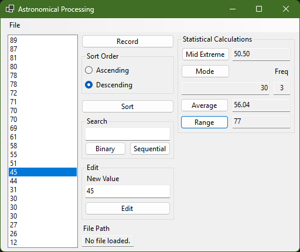

# C# ONE AT2  
Program for AT2 of C# ONE cluster.



## Running
To run, open in visual studio, or run the following command:  
```cmd
dotnet run --project AstronomicalProcessing
```

## Requirements
This program requires .NET 8  
To use a different version, edit the `.cproj ` file.
